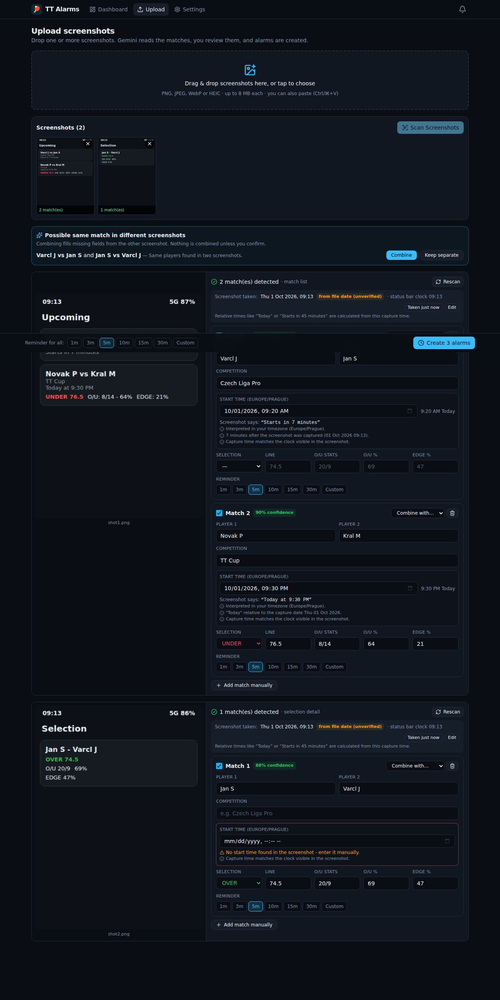
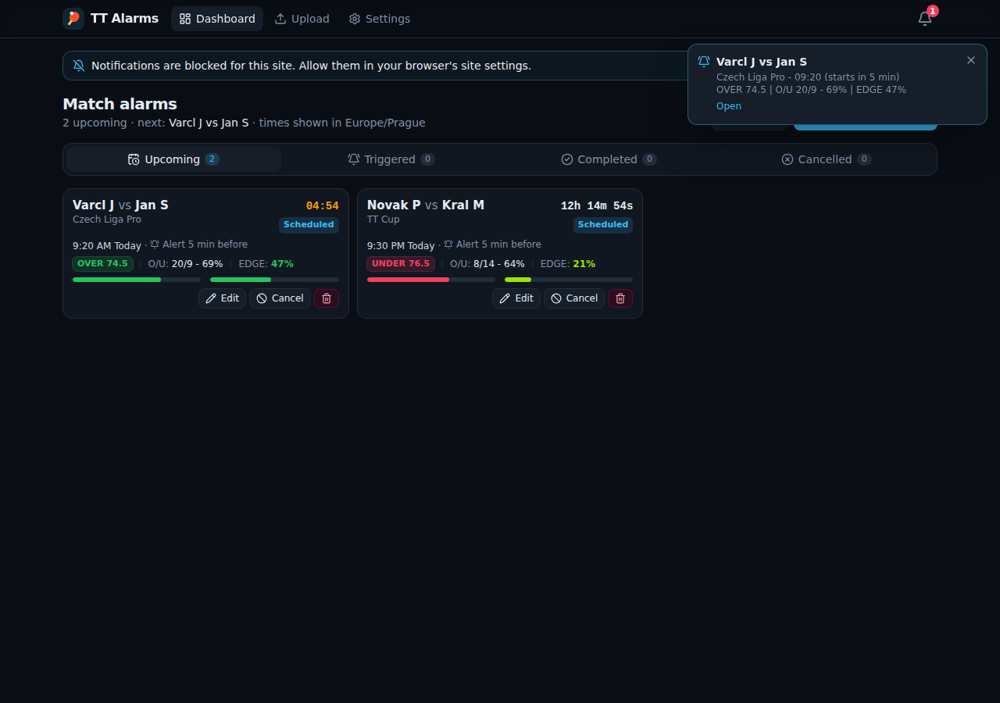
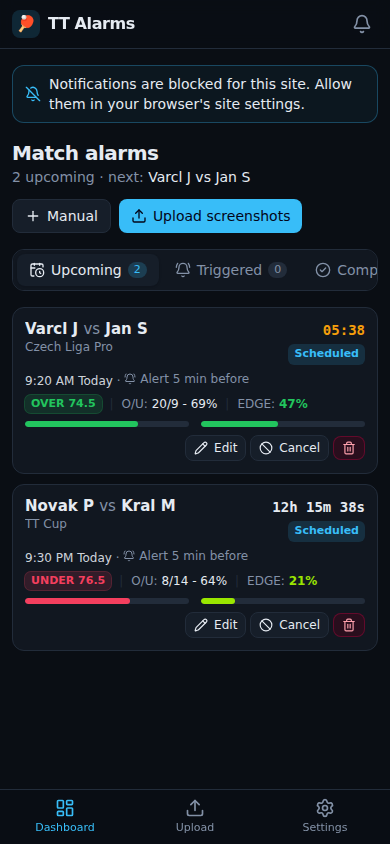

# TT Alarms — screenshot-to-alarm reminders for table tennis matches

Upload screenshots of upcoming table tennis matches, selections and statistics. Google Gemini reads them, you review and correct the extracted data next to the original image, and the app schedules server-side reminders that arrive as browser push and in-app notifications before each match starts.

| Review (screenshot beside extracted data) | Dashboard + in-app notification | Mobile |
| --- | --- | --- |
|  |  |  |

*(Screenshots come from the automated end-to-end run, which uses a mocked Gemini API and generated sample screenshots.)*

## Features

- **Upload**: drag and drop, multi-select or paste from the clipboard. Image previews, per-file upload progress and duplicate-upload detection (by SHA-256 hash).
- **Gemini extraction**: structured JSON output (`responseJsonSchema`) for player 1/2, competition, start time text, OVER/UNDER, points line, O/U record, O/U %, EDGE % and the status-bar clock. Every value is re-validated on the server. Invalid values become `null` with a warning and are never "repaired" by guessing.
- **Review**: each screenshot is shown beside its extracted matches. Every field can be edited. One screenshot can produce several alarms. Matches can be added manually.
- **Combining screenshots**: if two screenshots appear to show the same match (same players in either order), the app suggests combining them. Nothing is merged until you click **Combine**. Conflicting values are shown so you can pick one.
- **Time recognition**: `Today at 6:00 PM`, `Tomorrow at 10:30 AM`, `21/09/2026 at 15:00`, `Starts in 45 minutes`, `18:00 CET`, `UTC+2` offsets, weekday names, ISO and month-name dates. Anything uncertain is flagged for confirmation (see [Time handling](#time-handling)).
- **Alarms**: preset reminders of 1, 3, 5, 10, 15 or 30 minutes, or a custom value (0–1440 min). There is a default reminder plus a per-match override. You can edit, cancel, reactivate, mark done and delete alarms. Duplicates are refused.
- **Dashboard**: a compact dark layout with live countdowns, colour-coded OVER/UNDER, O/U and EDGE progress bars, and Upcoming / Triggered / Completed / Cancelled sections. It is responsive on desktop and mobile.
- **Notifications**: Web Push through a service worker (works when the app is closed), plus an in-app notification centre with pop-ups and an optional chime. Clicking a notification opens that match.
- **Reliable scheduling**: alarms are stored in PostgreSQL and dispatched by a server-side loop that claims work atomically. Retries, crash recovery and de-duplication are covered in [Scheduling](#scheduling-architecture).
- **Settings**: default reminder, timezone, date order, push/in-app/sound/statistics preferences, device subscriptions, test notification and server status.
- **Optional password protection** for internet-facing deployments.
- **Bot vs personal plays + profit tracking**: rows with an OVER/UNDER pick badge are bot plays, the rest are personal plays. Bets are tracked in units, and the **Profit** page compares the two (see [Profit tracking](#profit-tracking)).

## Tech stack

Next.js 16 (App Router) · React 19 · TypeScript · Tailwind CSS 4 · PostgreSQL · Prisma 7 (with `@prisma/adapter-pg`) · `@google/genai` (Gemini 3.5 Flash-Lite, with Gemini 3.8 Flash as automatic backup) · `web-push` (VAPID) · Zod 4 · Luxon · Vitest.

## Accounts and leaderboard

**First-run tutorial:** after signing up, a short tutorial asks where your picks come from. **Upload** needs **Cage Capital** screenshots (plus a free Gemini key); without Cage Capital you can get the picks from **Tailing**. It then asks which bookmaker you use and fills in **League links** for you: **Ladbrokes** (recommended: you rarely get limited, and it has Czech Liga Pro) or **Sportsbet** (you get limited extremely fast; TT Cup and TT Elite only). Next you choose when the alarm goes off. Ladbrokes publishes Over/Under points lines 5 minutes before a match and Sportsbet 30 minutes before, so picking a bookmaker pre-selects that time. After that it covers notifications, unit size (1u should be 1-2% of your bankroll) and how alarms and profit tracking work. It also shows what to do when the alarm goes off: click the players' names to open the league on your bookmaker, then bet in the **Total** market (Over/Under). It can't be skipped the first time and shows once per account; replay it (and close it any time) from **Settings → Account → Show the tutorial again**.

- **You need an account to use the app.** Sign up with a display name, email and password, or use **Continue with Google** (when the server has Google sign-in set up). A Google sign-in with the same email as an existing account signs into that account.
- **Each account is separate:** its own uploads, alarms, bets, Profit page, devices, settings and **Gemini API key** (Settings → Gemini API). Alarm notifications go only to the devices of the account that created the match. Signing out also stops that browser getting your notifications.
- **Upgrading an existing install:** the first account created takes over all matches, bets and settings that existed before accounts were added.
- **Leaderboard:** ranks accounts by **most units profited** (everyone with a settled bet) and **highest ROI** (only accounts with at least **100 settled bets**; until then the page shows how many more you need). Only settled bets count. Emails listed in `LEADERBOARD_ALWAYS_SHOW` (in `.env`, comma-separated) are ranked by ROI regardless of the minimum. You can filter to Bot or Personal plays. Only display names are shown, never emails. Turn off **Settings → Account → Show me on the leaderboard** to hide yourself.

## Tailing and profile pictures

- **Profile picture:** Settings → Account → **Add profile picture**. The browser crops and shrinks it to a small square before uploading. It shows in the account menu, on the Leaderboard and on the Tailing pages. Only signed-in users can load it.
- **Tailing** (menu item between Leaderboard and Settings): every account automatically tails **one account** - the app owner's (the first account created, or the one whose email is in `TAILING_ACCOUNT_EMAIL` in `.env`). The page shows that account's **upcoming bets** and a read-only **profit page** (all the filters and charts). The owner sees a preview of what everyone else sees.
- **Only tail bot (or personal) plays:** the **All plays / Bot only / Personal only** switch on the Tailing page filters the upcoming picks, and **Copy bets** copies only those. It's saved to your account.
- **Copy bets:** **Copy** adds one upcoming bet to your dashboard and **Copy bets** adds all of them. Copies get your default reminder, the same units as the play (e.g. 1.5u for a "1.5U OVER" bot pick) and your average odds (if ticked, otherwise the owner's odds). Bets already on your dashboard (same players, either order, within 3 hours) are never copied again and show as "On your dashboard". Copied matches show a "from <name>" tag. Emails and screenshots are never shared.

## Dashboard sections

**Upcoming → Triggered → Pending → Completed.** A match moves to **Pending** only when you confirm the bet is placed (**I've placed the bet** on the alarm, or the **Bet placed** button on the card), and moves to **Completed** when you mark the bet **Won / Lost / Void**. **Record bet** just notes the stake/odds early: the match stays where it is and its alarm still rings. Finished or cancelled matches without a pending bet are in **Completed**.

Placed the bet before the reminder? Click **Bet placed** on the card: the units are filled in from the play (e.g. 1.5U), you enter the odds you actually got (required), the alarm won't go off, and the match moves to Pending. Confirming on the alarm screen also requires the odds. Each card shows the play's units next to the pick.

## Match cards: screenshot and bookmaker links

- **Click a match card** (anywhere except its buttons) to see the screenshot it came from, full size. Arrow keys move between screenshots when a match was combined from several; Esc closes it. Matches without a screenshot open their details instead (also reachable with **Edit**).
- **Click the player names** to open that league's betting page (e.g. Ladbrokes or Sportsbet table tennis) in a new tab. Set one link per league in **Settings → League links** (TT Cup, TT Elite and Czech Liga Pro are listed to start with; add any others). League names match ignoring capitals and spaces. The alarm pop-up also has an **Open … on the bookmaker** button.

## Credentials and external services you need to configure

| What | Required? | Where to get it | Env variable(s) |
| --- | --- | --- | --- |
| PostgreSQL 14+ database | **Yes** | Local install, Docker (`docker compose`), or a hosted service (Neon, Supabase, Railway, RDS…) | `DATABASE_URL` |
| Google Gemini API key | **Yes**, for scanning (one per user) | <https://aistudio.google.com/apikey> (free tier available) | None: each user enters their own key in **Settings → Gemini API** (with the model and backup model) |
| VAPID key pair for Web Push | **Yes**, for background push | Run `npm run vapid` locally. No account is needed. | `VAPID_PUBLIC_KEY`, `VAPID_PRIVATE_KEY`, `VAPID_SUBJECT` |
| Cron secret | Only for `SCHEDULER_MODE=external` | `openssl rand -hex 32` | `CRON_SECRET` |
| Session secret | Optional (one is generated and stored in the database if unset) | `openssl rand -hex 32` | `SESSION_SECRET` |
| Google sign-in | Optional ("Continue with Google") | Google Cloud Console → APIs & Services → Credentials → OAuth client ID (Web application). Redirect URI: `<APP_URL>/api/auth/google/callback` | `GOOGLE_CLIENT_ID`, `GOOGLE_CLIENT_SECRET`, `APP_URL` |
| External cron service | Only on serverless hosts (Vercel etc.) | cron-job.org, Upstash QStash, Vercel Cron (Pro) | — |

All secrets stay on the server. The browser only receives the VAPID **public** key, from `/api/push/config` at runtime. `.env` is git-ignored, and `.env.example` documents every variable.

## Local setup

Prerequisites: Node.js 20.19+ (22 recommended) and PostgreSQL.

```bash
# 1. Install dependencies (also generates the Prisma client)
npm install

# 2. Configure environment
cp .env.example .env
#    - set DATABASE_URL
#    - optional: GOOGLE_CLIENT_ID / GOOGLE_CLIENT_SECRET / APP_URL for "Continue with Google"
#    - npm run vapid  -> paste both keys into VAPID_PUBLIC_KEY / VAPID_PRIVATE_KEY

# 3. Create the database schema
npx prisma migrate deploy        # or: npm run db:migrate:dev while developing

# 4. Run
npm run dev                      # http://localhost:3000
```

Then:

1. Open the dashboard and confirm your timezone (a banner offers your browser's timezone).
2. Click **Enable** on the notifications banner, or use Settings → *Enable notifications*. Then use **Send test notification** to check that push works.
3. Open **Upload**, drop your screenshots and click **Scan Screenshots**. Review and correct the results, confirm any flagged times, choose reminders and click **Create alarms**.

No Postgres installed? Run `docker compose up -d db` and set
`DATABASE_URL=postgresql://tt:tt@localhost:5432/table_tennis?schema=public`. The compose file does not publish the DB port by default. Add `ports: ["5432:5432"]` to the `db` service if you need it.

### Scripts

| Command | Purpose |
| --- | --- |
| `npm run dev` / `build` / `start` | Next.js development / production build / production server |
| `npm run worker` | Standalone alarm scheduler process |
| `npm test` | Vitest test suite (add `TEST_DATABASE_URL` to include the Postgres integration tests) |
| `npm run lint` / `npm run typecheck` | ESLint / TypeScript |
| `npm run db:migrate` | Apply migrations (`prisma migrate deploy`) |
| `npm run db:migrate:dev` | Create/apply migrations during development |
| `npm run db:studio` | Browse the database |
| `npm run vapid` | Generate VAPID keys |

## Scheduling architecture

Browser timers alone cannot be trusted: tabs sleep, phones lock and servers restart. Instead:

1. **Alarms live in Postgres.** Each alarm stores `fireAt = startsAt − reminderMinutes`, a `status` and `nextAttemptAt`. Nothing is held only in memory, so alarms survive restarts and deploys.
2. **A dispatcher claims due alarms atomically.** It uses `UPDATE … WHERE id IN (SELECT … FOR UPDATE SKIP LOCKED) RETURNING id`, so several dispatchers (web server, worker, cron) can run at once and none of them processes the same alarm twice.
3. **Delivery is de-duplicated.** There is a unique delivery row per `(alarm, generation, subscription)`, a unique in-app notification per `(alarm, generation)`, and a notification `tag` so the OS replaces rather than stacks notifications. Editing an alarm bumps `generation`, so a rescheduled alarm is delivered again.
4. **Failures are handled.**
   - Transient push errors (429/5xx/network) are retried with backoff until the match starts, without re-sending to devices that already received the push.
   - `404`/`410` deactivate the expired subscription.
   - A crashed dispatcher's lock is reclaimed after 2 minutes.
   - After downtime, alarms are still delivered if the match started less than 5 minutes ago. Otherwise they are marked *Failed – missed*.
   - Pushes carry a TTL that ends when the match starts, so a device that was offline doesn't get a stale reminder.
5. **After the match starts**, triggered alarms move to *Completed* automatically.

### Choosing a scheduler mode (`SCHEDULER_MODE`)

| Mode | Use when | How it runs | Precision |
| --- | --- | --- | --- |
| `inprocess` (default) | One long-running Node server (`npm start` on a VPS, Railway, Render, Fly.io) | `src/instrumentation.ts` starts the loop inside the Next.js server | ~1 s (polls every `SCHEDULER_INTERVAL_MS`, and also wakes when the next alarm is due) |
| `worker` | Docker/VPS with a separate process (**recommended**) | `npm run worker` (the `worker` service in `docker-compose.yml`) | ~1 s for existing alarms; up to one poll interval for alarms created less than 10 s before they're due |
| `external` | Serverless (Vercel, Netlify) where background processes aren't allowed | A cron service calls `GET /api/cron/dispatch` with `Authorization: Bearer $CRON_SECRET` | Up to the cron interval (typically 1 min) |

**Recommendation:** the most reliable setup for minute-level reminders is a long-running host (Docker Compose on a small VPS, Railway, Render or Fly.io) with the `worker` or `inprocess` mode. On Vercel you need an external every-minute trigger:

- **Vercel Cron:** Hobby plans only allow daily jobs, so this needs the Pro plan. Add `vercel.json` with `{"crons":[{"path":"/api/cron/dispatch","schedule":"* * * * *"}]}`. Vercel sends `Authorization: Bearer $CRON_SECRET` automatically when `CRON_SECRET` is set.
- **cron-job.org** (free): call `https://your-app/api/cron/dispatch` every minute with the header `Authorization: Bearer <CRON_SECRET>`.
- GitHub Actions schedules are best-effort and often delayed by several minutes, so they are not suitable for 1–5 minute reminders.

Running more than one mode at the same time is safe because claims are atomic.

## Deployment

### Free hosting: Vercel + Supabase + cron-job.org

All three have free plans. Together they run the app 24/7 with your PC off.

1. **Database: Supabase** (supabase.com)
   - Create a project. Choose the region closest to you (e.g. Sydney) and save the database password.
   - Click **Connect → Direct** and copy two connection strings. In each, replace `[YOUR-PASSWORD]` with your password and add `?sslmode=require` to the end.
     - The **Transaction pooler** string (port **6543**) is your `DATABASE_URL`, used by the app.
     - The **Session pooler** string (port **5432**) is your `DIRECT_URL`, used only for database migrations during builds.
   - Don't use the Session pooler for `DATABASE_URL`: it allows only ~15 connections, and Vercel's instances use them up ("max clients reached in session mode").
2. **App: Vercel** (vercel.com)
   - Sign in with GitHub and choose **Add New → Project**. Import this repository; the Next.js settings are detected.
   - Under **Environment Variables**, add the values from your `.env`, with these changes:
     - `DATABASE_URL` = the Supabase Transaction pooler string (port 6543)
     - `DIRECT_URL` = the Supabase Session pooler string (port 5432)
     - `APP_URL` = your Vercel address, e.g. `https://tt-alarms.vercel.app` (you can add it after the first deploy, then redeploy)
     - `CRON_SECRET` = a long random password (`openssl rand -hex 32`)
     - keep your `VAPID_*` keys and `SESSION_SECRET`
     - you don't need `SCHEDULER_MODE`: on Vercel it defaults to `external`
   - Click **Deploy**. The `vercel-build` script applies the database migrations, then builds the app.
   - `vercel.json` runs the app in Vercel's Sydney region (`syd1`), next to a Sydney Supabase database. If your database is elsewhere, change it to the matching region (e.g. `sin1`, `iad1`, `fra1`). A server far from the database adds a noticeable delay to every click.
3. **Alarms: cron-job.org**
   - Create a cron job that runs **every minute**.
   - URL: `https://<your-app>.vercel.app/api/cron/dispatch`.
   - Under **Advanced → Headers**, add `Authorization` = `Bearer <your CRON_SECRET>`.
4. **Google sign-in (optional):** add `https://<your-app>.vercel.app/api/auth/google/callback` to the OAuth client's redirect URIs.

**Free plan limits:**
- Alarms are checked once a minute, so one can be up to about a minute late.
- Uploads over ~3.8 MB are re-encoded as JPEG in the browser (Vercel's request limit is 4.5 MB).
- Supabase's free database holds 500 MB; screenshots use most of that space.
- Vercel's free plan is for non-commercial use.
- Apps poll less often in the background to stay well within the free request allowance.

**Updating:** push to GitHub. Vercel rebuilds and redeploys automatically (about 1–2 minutes) and runs new database migrations. Browsers and the desktop app pick up the new version on their next reload. The desktop app also reloads by itself when it is reopened after being in the tray for 30+ minutes.

### Windows desktop app (.exe)

`desktop/` is a small Electron app: an installable Windows program that opens your hosted app in its own window.
- It sits in the tray when closed, so alarms still ring and Windows notifications still show.
- It starts with Windows (untick **Start with Windows** in the tray menu to stop that).
- Bookmaker links open in your normal browser. Google sign-in works inside the app.

App changes reach it automatically (it loads your server). You only need a new installer when `desktop/` itself changes.

**Build the installer on GitHub (no setup):**
1. Go to **Actions → Windows app → Run workflow** and enter your app's address, e.g. `https://tt-alarms.vercel.app`. Or set it once as the `APP_URL` repository variable under Settings → Secrets and variables → Actions → Variables.
2. When the run finishes (about 5 minutes), download **TT-Alarms-Setup** under **Artifacts**. It is a zip containing `TT-Alarms-Setup-1.0.0.exe`.
3. Share the `.exe` (Google Drive, Discord...). Pushing a tag such as `desktop-v1.0.0` also attaches it to a GitHub Release.

**Or build on a Windows PC:**
```powershell
cd desktop
# put your address in config.json: { "appUrl": "https://tt-alarms.vercel.app" }
npm install
npm run dist        # -> desktop\dist\TT-Alarms-Setup-1.0.0.exe
```
Use `npm start` to try it without installing. `TT_APP_URL=http://localhost:3000 npm start` points it at a local server.

The installer isn't code-signed, so Windows SmartScreen shows "Windows protected your PC" the first time. Click **More info → Run anyway**. Removing the warning needs a paid code-signing certificate.

Web Push isn't available inside Electron. The desktop app shows its own Windows notifications while it's running (including from the tray); phones keep using Web Push.

### Docker Compose (Postgres + web + worker)

```bash
cp .env.example .env     # fill in the VAPID keys (and Google sign-in, if wanted)
docker compose up -d --build
# open http://localhost:3000 (put it behind HTTPS for push - see below)
```

The web container applies migrations on start (`prisma migrate deploy`).

### Any Node host

```bash
npm ci && npm run build
npx prisma migrate deploy
npm start                  # SCHEDULER_MODE=inprocess
# or: SCHEDULER_MODE=worker npm start  +  npm run worker  (two processes)
```

**HTTPS is required for service workers and push** everywhere except `localhost`. Use your platform's TLS or a reverse proxy such as Caddy, nginx or Cloudflare Tunnel.

## Alarm until the bet is placed (computers) vs one notification (phones)

Each device that enables notifications is marked as a **computer** or a **phone** (auto-detected; switchable in Settings → devices).

- **Computer:** when a reminder fires, every open TT Alarms tab shows a full-screen alert and plays a **continuous siren** until you click **"I've placed the bet"** (or **Skip**). The system notification stays on screen with **✅ Bet placed / Skip** buttons and is re-sent every 15/30/60 s (Settings) until you confirm or the match starts.
- **Phone:** one normal notification. No siren, no repeats.
- Confirming on any device stops the alarm everywhere. The match card then shows **Bet placed ✓** or **Skipped**.
- The siren can only play from an open browser tab (it can be in the background). Keep a TT Alarms tab open on the computer. Browsers block sound until you've clicked the page once; use **Settings → Test alarm sound**.
- Turn it off with **Settings → Alarm on computers → Ring until I confirm the bet**.
- **Alarm volume and sound:** in the same section. The volume slider defaults to 15% (much quieter than the original siren), and you can pick Siren, Alarm clock, Chime, Pulse or Rising. Clicking a sound plays a short preview. Both also apply to the in-app notification chime.

## Profit tracking

- **Bot play vs personal play:** a match whose screenshot shows an OVER / UNDER / SWEEP pick badge (e.g. `1U OVER (12/17, 71%)`) is a **bot play**. A match without one is a **personal play**; its pick comes from the O/U %: over 50% is **OVER**, under 50% is **UNDER** (exactly 50% is left for you to choose). Scans never pick **SWEEP** (it is easily misread from the SWEEP statistic): a SWEEP read from a screenshot is replaced by the O/U rule (a `1U SWEEP` badge still makes it a bot play). Choose SWEEP yourself when you want it. The badge stake (`1U`, `2U`) is read too. You can switch the type on the review screen or on the match page.
- **Recording a bet:** "I've placed the bet" on the computer alarm asks for the stake (in units) and the decimal odds, pre-filled with what was set when the match was uploaded. You can also click **Record bet** on any match card. Then mark it **Won / Lost / Void**.
- **Profit:** won = stake × (odds − 1), lost = −stake, void = 0. A win without odds is not counted until you add the odds.
- **Defaults when you upload:** every new match starts with a **1u** stake. Tick **Settings → Average odds** and new uploads also get your average odds (e.g. 1.85). Both can be changed on the review screen before you create the alarms, and they are used when you click "I've placed the bet". Changing the setting later never changes matches or bets you already have.
- **Profit page:** everything is shown in **units**, with the money amount to the right (units × the unit size). Set what 1 unit is worth (and the currency symbol) in **Settings → Units**. The page has:
  - a Bot vs Personal comparison (profit, ROI, win rate, record, staked);
  - a **Picks** comparison: OVER, UNDER and SWEEP cards (profit, ROI, win rate, record). Click a card, or use the **Pick** filter, to see only that pick everywhere on the page;
  - **Running profit → By pick** draws one line each for OVER, UNDER and SWEEP so you can compare them over time;
  - a **running profit graph** for the chosen period (7D / 30D / 90D / All) - hover or use the arrow keys to read any day;
  - a **daily P/L calendar** (green/red by the day's result). Click a day to list that day's bets;
  - **matchups:** how often the two players have met before, from the O/U record (11/3 = 14). The **Matchups** filter (Under 10 / 10–20 / Over 20) narrows everything on the page, and three cards show the profit of each group. It works for bets you already have, as long as they have O/U stats; each row shows its matchups;
- **past bets:** **Add past bet** records a bet on a match that has already been played (players, date, Bot/Personal, pick, line, units, odds, result). **Scan bet slips** reads screenshots of your settled bets from Ladbrokes or Sportsbet with Gemini: **Win** counts as won, **No Return** as lost, and the stake is turned into units with your unit size. Check the rows, then add them. Past bets get no alarm and count towards profit straight away;
- **split bets:** one play can be split over 2-3 picks, e.g. 0.5u UNDER + 0.5u SWEEP (**Split between picks** on the alarm screen or in a match's bet editor). Each pick has its own stake, odds and Won/Lost/Void. The play stays Pending until every pick is settled, then counts as won or lost by its net profit. On the Profit page each pick is its own row ("split 1/2"), so the Over/Under/Sweep stats count each part. The leaderboard counts the play once, with its net profit;
- clicking **Bot** or **Personal** (the filter or the comparison cards) limits the graph, the calendar and the list to those plays;
  - a breakdown per competition;
  - a sortable bet list (date / stake / odds / profit);
  - period and play-type filters at the top that apply to the whole page.
- **API:** `PUT/DELETE /api/matches/:id/bet` (`{stake, odds, result}`), and `GET /api/stats?days=30&type=BOT`.

## Notifications: what browsers and phones can and cannot do

These are **notifications, not native phone alarms**:

- They do not ring continuously. They respect Do Not Disturb/Focus and silent mode, and the OS decides how they are shown.
- **iPhone/iPad:** Web Push only works on iOS/iPadOS 16.4+ **after adding the app to the Home Screen** (Share → Add to Home Screen) and enabling notifications from the installed app. Safari tabs cannot receive push.
- **Android:** Chrome, Edge and Firefox deliver push in the background. Battery saver or aggressive vendor battery optimisation can delay delivery.
- **Desktop:** the browser usually needs to be running (it can be in the background or minimised). On macOS, notifications must also be allowed for the browser in System Settings.
- Private/incognito windows generally cannot receive push. Blocked permissions can only be re-enabled from the browser's site settings.
- In-app notifications and the chime only work while the app is open. Browsers may block sound until you have interacted with the page.
- Delivery depends on the browser vendor's push service (FCM, Mozilla autopush, Apple). The app records failures per device on the Settings page.

## Time handling

Gemini only **transcribes** the time text it sees. All date arithmetic is done by deterministic code (`src/lib/time/resolve.ts`):

- **Capture time** is taken from, in order: EXIF `DateTimeOriginal` (with its offset if present), then the file's last-modified time, then nothing. A file-modified time counts as reliable only when it matches the clock visible in the screenshot's status bar (within 3 minutes). Otherwise it is flagged. On the review screen you can enter the capture time or click *Taken just now*.
- **Timezone** comes from a label printed in the screenshot (`CET`, `UTC+2`, …) if there is one. Otherwise your confirmed timezone from Settings is used. If your timezone is not confirmed, every time needs confirmation.
- The app **never guesses**. These cases are shown in amber and need an explicit "I checked this start time" tick or a manual edit:
  - relative times without a reliable capture time
  - ambiguous dates such as `03/04/2026` (the alternative reading is shown)
  - missing years
  - time-only text
  - weekday names
  - times in the past
  - live matches

  If no time is visible at all, the field stays empty and you enter it yourself.
- Confirmed times are stored as UTC (`timestamptz`) together with the IANA timezone used, so alarms trigger correctly across DST changes.

## Duplicate prevention

- **Uploads:** an identical image (same SHA-256 hash) reuses the existing screenshot and its scan, so Gemini isn't called again unless you click *Rescan*.
- **Scanning:** a screenshot that is already *processing* can't be scanned twice at the same time.
- **Matches:** a unique `dedupeKey` (normalised player names in any order + start minute) is enforced by the database. If the same players already have a match within ±3 hours, you are asked to confirm before another one is created.
- **Alarms:** each match has exactly one alarm (unique `matchId`), and delivery is de-duplicated as described above.

## Testing

```bash
npm test                                   # unit tests (Gemini API mocked)
TEST_DATABASE_URL=postgresql://... npm test  # + PostgreSQL integration tests (database must be migrated)
```

The suites cover:

- `tests/gemini-extraction.test.ts`: request shape (image, JSON schema, default temperature), validation and coercion, nulls for missing data, rejected/invalid output, API error handling. `@google/genai` is mocked.
- `tests/time-resolve.test.ts`: all required time formats, timezones, DST, ambiguous dates, and every "needs confirmation" path.
- `tests/alarm-scheduling.test.ts`: the 17:55 trigger time for an 18:00 match with a 5-min reminder, concurrent dispatchers, retries, expired subscriptions, missed alarms, crash recovery, edits during sending, auto-completion, and notification text.
- `tests/duplicates-and-validation.test.ts`: name normalisation, duplicate keys, merge suggestions and merging, candidate validation, API schemas, image type sniffing and session tokens.
- `tests/db-integration.test.ts`: real Postgres. Covers duplicate prevention under concurrent requests, `SKIP LOCKED` claiming across connections, rescheduling and cancelling.

CI (`.github/workflows/ci.yml`) runs lint, typecheck, all tests against a Postgres service, and a production build.

## Project structure

```
prisma/
  schema.prisma              # database schema
  migrations/                # SQL migrations
public/
  sw.js                      # service worker: push display + click-to-open
  icons/                     # PWA / notification icons
src/
  app/                       # App Router pages and API routes
    page.tsx                 # dashboard
    upload/                  # upload + review
    matches/[id]/, matches/new/
    settings/, login/
    api/                     # screenshots, extract, matches, alarms, push, notifications, settings, cron, auth, health
  components/                # UI (dashboard, match card, review forms, providers)
  lib/
    gemini/                  # prompt, JSON schema, client call, server-side validation
    time/resolve.ts          # deterministic time resolution
    alarms/                  # schedule maths, dispatcher, Prisma store, service layer, notification text
    matching/dedupe.ts       # duplicate keys + merge suggestions
    review/candidate.ts      # review-screen model, merge and validation
    push/, scheduler/        # web-push sender, scheduler loop
    validation/              # Zod schemas
  instrumentation.ts         # starts the in-process scheduler
  proxy.ts                   # optional password protection
  worker/index.ts            # standalone scheduler worker
tests/                       # Vitest suites
```

## Security notes

- Gemini, VAPID private, cron and session secrets are read only on the server (`src/lib/env.ts`). None of them are `NEXT_PUBLIC_*`.
- Uploads are capped at 8 MB. Their type is detected from magic bytes (PNG/JPEG/WebP/HEIC only), and images are served with `nosniff`.
- All API input is validated with Zod. Gemini output is treated as untrusted.
- Every page and API route needs a signed-in account, and every query is limited to that account's own data. Passwords are hashed with scrypt; sessions are signed, HTTP-only cookies. Sign-in attempts are rate-limited.
- Each user's Gemini key is stored on the server and never sent back to the browser.

## Troubleshooting

- **"Cannot reach the database" banner:** check `DATABASE_URL` and run `npx prisma migrate deploy`.
- **"Gemini is overloaded" / 503:** Google's servers are busy. The app tries the main model and then the backup model straight away, and repeats that up to 3 rounds. If all fail, wait a minute and press **Retry**, or pick a different model in **Settings → Gemini API**. You can enter several backup models separated by commas.
- **"Gemini model not found" (404):** the model name is wrong for your key. Press **Test current key** in Settings: it lists the models your key can use. Click one to use it.
- **Scan fails with `gemini_not_configured`:** add your Gemini API key in **Settings → Gemini API** (every account needs its own). With `gemini_unavailable` (429/5xx), wait and click *Rescan*.
- **"Continue with Google" says it isn't set up:** set `GOOGLE_CLIENT_ID` and `GOOGLE_CLIENT_SECRET` and restart. **Google says `redirect_uri_mismatch`:** add exactly `<APP_URL>/api/auth/google/callback` to the OAuth client's Authorized redirect URIs, and set `APP_URL` to the address you open the app on.
- **No push notifications:**
  - Check Settings → Server status (VAPID keys) and the permission state.
  - Use *Send test notification*.
  - Make sure the site is served over HTTPS.
  - On iOS, install the app to the Home Screen first.
- **Alarms not firing:** make sure a scheduler is running. Look for `[scheduler] started` in the server logs, check that `npm run worker` is running, or that your cron service calls `/api/cron/dispatch`.

## Note on the reference screenshots

The two reference screenshots mentioned in the original brief did not arrive with the request. The dashboard design follows the written description (compact dark cards, `OVER | O/U: 20/9 - 69% | EDGE: 47%` line, colour-coded selections, progress bars). The Gemini prompt is layout-agnostic. Once real screenshots are available, scan them and adjust `src/lib/gemini/schema.ts` if any field needs extra guidance.
